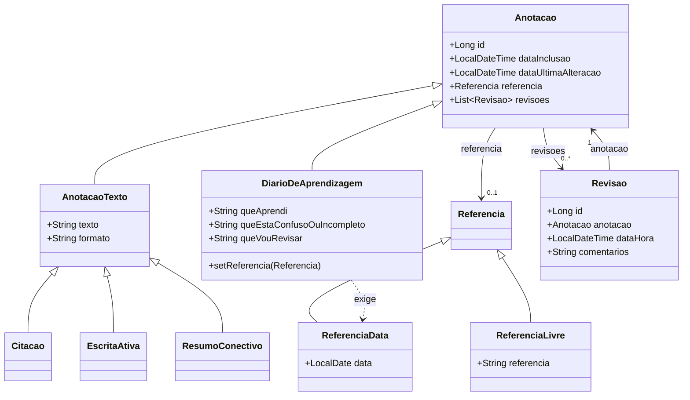

```mermaid
classDiagram
    class Anotacao {
        +Long id
        +LocalDateTime dataInclusao
        +LocalDateTime dataUltimaAlteracao
        +Referencia referencia
        +List~Revisao~ revisoes
    }

    class AnotacaoTexto {
        +String texto
        +String formato
    }

    class DiarioDeAprendizagem {
        +String queAprendi
        +String queEstaConfusoOuIncompleto
        +String queVouRevisar
        +setReferencia(Referencia)
    }

    class Citacao
    class EscritaAtiva
    class ResumoConectivo

    class Referencia
    class ReferenciaLivre {
        +String referencia
    }
    class ReferenciaData {
        +LocalDate data
    }

    class Revisao {
        +Long id
        +Anotacao anotacao
        +LocalDateTime dataHora
        +String comentarios
    }

    Anotacao <|-- AnotacaoTexto
    Anotacao <|-- DiarioDeAprendizagem

    AnotacaoTexto <|-- Citacao
    AnotacaoTexto <|-- EscritaAtiva
    AnotacaoTexto <|-- ResumoConectivo

    Referencia <|-- ReferenciaLivre
    Referencia <|-- ReferenciaData

    Anotacao --> "0..1" Referencia : referencia
    Anotacao --> "0..*" Revisao : revisoes
    Revisao --> "1" Anotacao : anotacao
    DiarioDeAprendizagem ..> ReferenciaData : exige
```
