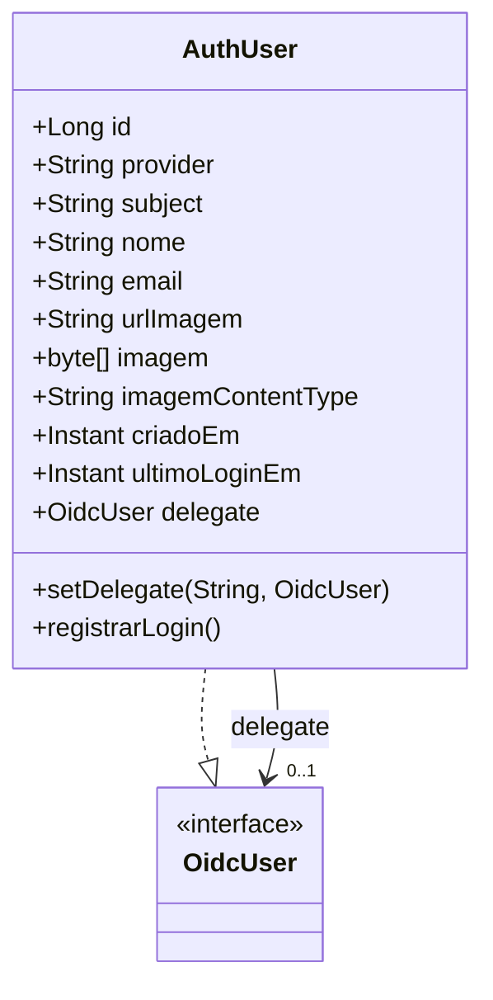

```mermaid
classDiagram
    class AuthUser {
        +Long id
        +String provider
        +String subject
        +String nome
        +String email
        +String urlImagem
        +byte[] imagem
        +String imagemContentType
        +Instant criadoEm
        +Instant ultimoLoginEm
        +OidcUser delegate
        +setDelegate(String, OidcUser)
        +registrarLogin()
    }

    class OidcUser {
        <<interface>>
    }

    AuthUser ..|> OidcUser
    AuthUser --> "0..1" OidcUser : delegate
```
