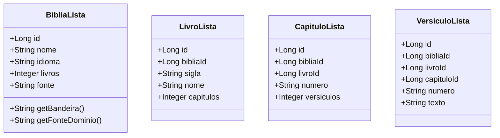

```mermaid
classDiagram
    class BibliaLista {
        +Long id
        +String nome
        +String idioma
        +Integer livros
        +String fonte
        +String getBandeira()
        +String getFonteDominio()
    }

    class LivroLista {
        +Long id
        +Long bibliaId
        +String sigla
        +String nome
        +Integer capitulos
    }

    class CapituloLista {
        +Long id
        +Long bibliaId
        +Long livroId
        +String numero
        +Integer versiculos
    }

    class VersiculoLista {
        +Long id
        +Long bibliaId
        +Long livroId
        +Long capituloId
        +String numero
        +String texto
    }
```
