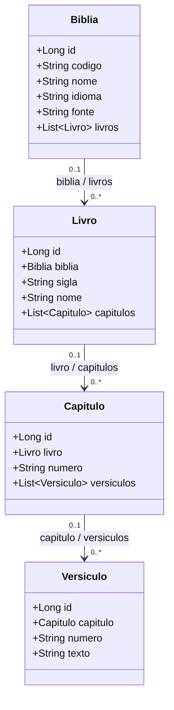

```mermaid
classDiagram
    class Biblia {
        +Long id
        +String codigo
        +String nome
        +String idioma
        +String fonte
        +List~Livro~ livros
    }

    class Livro {
        +Long id
        +Biblia biblia
        +String sigla
        +String nome
        +List~Capitulo~ capitulos
    }

    class Capitulo {
        +Long id
        +Livro livro
        +String numero
        +List~Versiculo~ versiculos
    }

    class Versiculo {
        +Long id
        +Capitulo capitulo
        +String numero
        +String texto
    }

    Biblia "0..1" --> "0..*" Livro : biblia / livros
    Livro "0..1" --> "0..*" Capitulo : livro / capitulos
    Capitulo "0..1" --> "0..*" Versiculo : capitulo / versiculos
```
