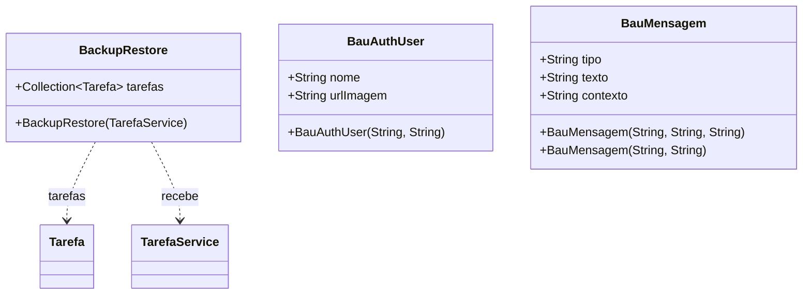

```mermaid
classDiagram
    class BackupRestore {
        +Collection~Tarefa~ tarefas
        +BackupRestore(TarefaService)
    }

    class BauAuthUser {
        +String nome
        +String urlImagem
        +BauAuthUser(String, String)
    }

    class BauMensagem {
        +String tipo
        +String texto
        +String contexto
        +BauMensagem(String, String, String)
        +BauMensagem(String, String)
    }

    class Tarefa
    class TarefaService

    BackupRestore ..> Tarefa : tarefas
    BackupRestore ..> TarefaService : recebe
```
