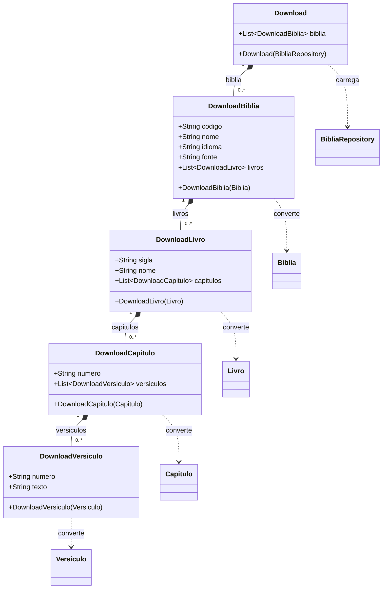

```mermaid
classDiagram
    class Download {
        +List~DownloadBiblia~ biblia
        +Download(BibliaRepository)
    }

    class DownloadBiblia {
        +String codigo
        +String nome
        +String idioma
        +String fonte
        +List~DownloadLivro~ livros
        +DownloadBiblia(Biblia)
    }

    class DownloadLivro {
        +String sigla
        +String nome
        +List~DownloadCapitulo~ capitulos
        +DownloadLivro(Livro)
    }

    class DownloadCapitulo {
        +String numero
        +List~DownloadVersiculo~ versiculos
        +DownloadCapitulo(Capitulo)
    }

    class DownloadVersiculo {
        +String numero
        +String texto
        +DownloadVersiculo(Versiculo)
    }

    class BibliaRepository
    class Biblia
    class Livro
    class Capitulo
    class Versiculo

    Download "1" *-- "0..*" DownloadBiblia : biblia
    DownloadBiblia "1" *-- "0..*" DownloadLivro : livros
    DownloadLivro "1" *-- "0..*" DownloadCapitulo : capitulos
    DownloadCapitulo "1" *-- "0..*" DownloadVersiculo : versiculos

    Download ..> BibliaRepository : carrega
    DownloadBiblia ..> Biblia : converte
    DownloadLivro ..> Livro : converte
    DownloadCapitulo ..> Capitulo : converte
    DownloadVersiculo ..> Versiculo : converte
```
