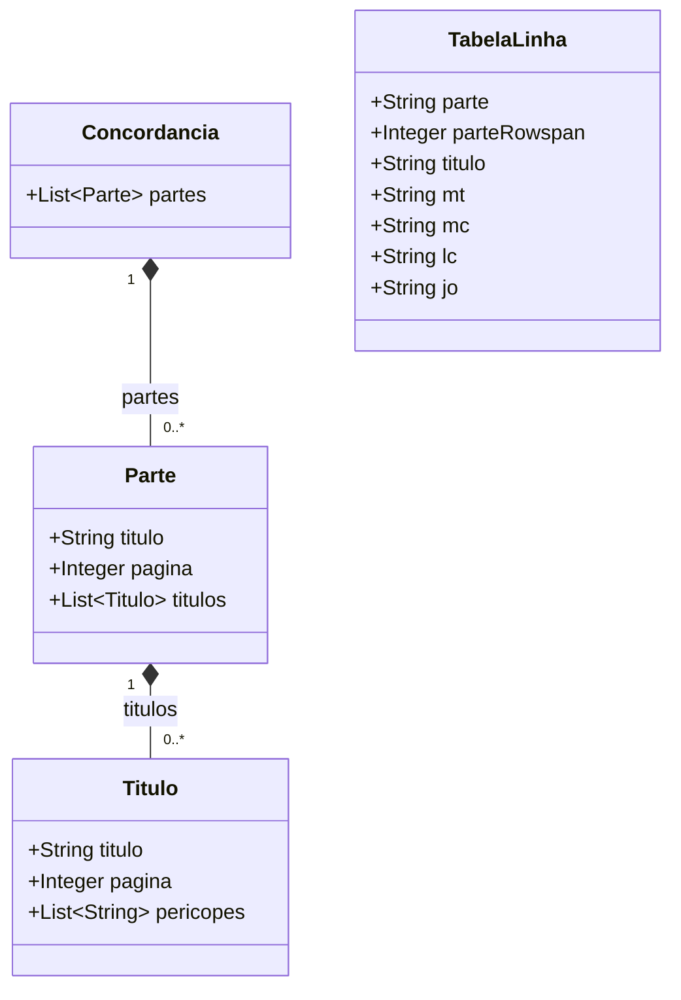

```mermaid
classDiagram
    class Concordancia {
        +List~Parte~ partes
    }

    class Parte {
        +String titulo
        +Integer pagina
        +List~Titulo~ titulos
    }

    class Titulo {
        +String titulo
        +Integer pagina
        +List~String~ pericopes
    }

    class TabelaLinha {
        +String parte
        +Integer parteRowspan
        +String titulo
        +String mt
        +String mc
        +String lc
        +String jo
    }

    Concordancia "1" *-- "0..*" Parte : partes
    Parte "1" *-- "0..*" Titulo : titulos
```
