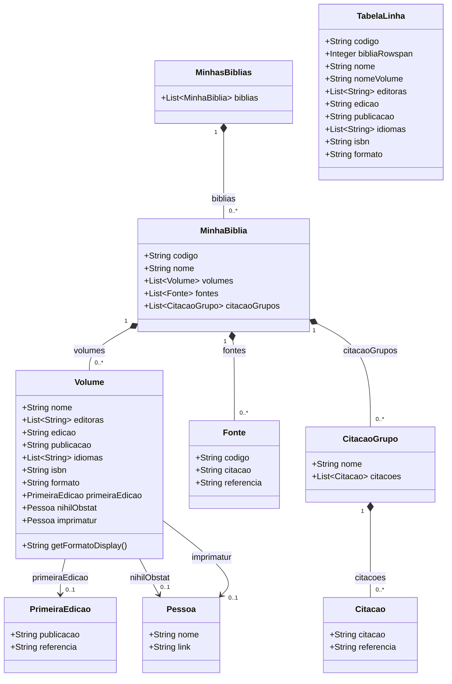

```mermaid
classDiagram
    class MinhasBiblias {
        +List~MinhaBiblia~ biblias
    }

    class MinhaBiblia {
        +String codigo
        +String nome
        +List~Volume~ volumes
        +List~Fonte~ fontes
        +List~CitacaoGrupo~ citacaoGrupos
    }

    class Volume {
        +String nome
        +List~String~ editoras
        +String edicao
        +String publicacao
        +List~String~ idiomas
        +String isbn
        +String formato
        +PrimeiraEdicao primeiraEdicao
        +Pessoa nihilObstat
        +Pessoa imprimatur
        +String getFormatoDisplay()
    }

    class Fonte {
        +String codigo
        +String citacao
        +String referencia
    }

    class CitacaoGrupo {
        +String nome
        +List~Citacao~ citacoes
    }

    class Citacao {
        +String citacao
        +String referencia
    }

    class PrimeiraEdicao {
        +String publicacao
        +String referencia
    }

    class Pessoa {
        +String nome
        +String link
    }

    class TabelaLinha {
        +String codigo
        +Integer bibliaRowspan
        +String nome
        +String nomeVolume
        +List~String~ editoras
        +String edicao
        +String publicacao
        +List~String~ idiomas
        +String isbn
        +String formato
    }

    MinhasBiblias "1" *-- "0..*" MinhaBiblia : biblias
    MinhaBiblia "1" *-- "0..*" Volume : volumes
    MinhaBiblia "1" *-- "0..*" Fonte : fontes
    MinhaBiblia "1" *-- "0..*" CitacaoGrupo : citacaoGrupos
    CitacaoGrupo "1" *-- "0..*" Citacao : citacoes
    Volume --> "0..1" PrimeiraEdicao : primeiraEdicao
    Volume --> "0..1" Pessoa : nihilObstat
    Volume --> "0..1" Pessoa : imprimatur
```
