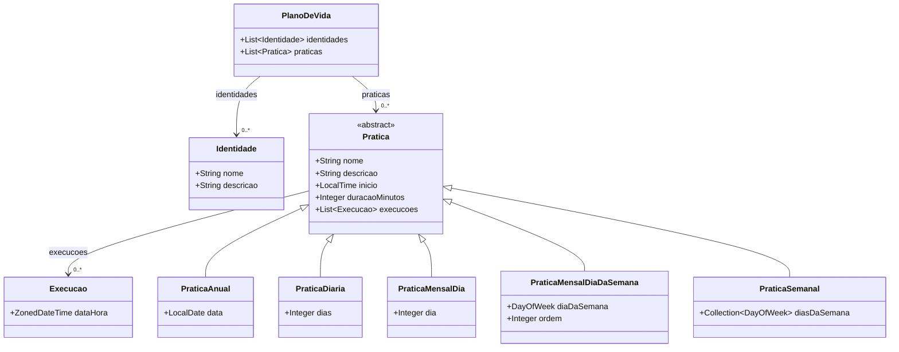

```mermaid
classDiagram
    class PlanoDeVida {
        +List~Identidade~ identidades
        +List~Pratica~ praticas
    }

    class Identidade {
        +String nome
        +String descricao
    }

    class Pratica {
        <<abstract>>
        +String nome
        +String descricao
        +LocalTime inicio
        +Integer duracaoMinutos
        +List~Execucao~ execucoes
    }

    class Execucao {
        +ZonedDateTime dataHora
    }

    class PraticaAnual {
        +LocalDate data
    }

    class PraticaDiaria {
        +Integer dias
    }

    class PraticaMensalDia {
        +Integer dia
    }

    class PraticaMensalDiaDaSemana {
        +DayOfWeek diaDaSemana
        +Integer ordem
    }

    class PraticaSemanal {
        +Collection~DayOfWeek~ diasDaSemana
    }

    PlanoDeVida --> "0..*" Identidade : identidades
    PlanoDeVida --> "0..*" Pratica : praticas
    Pratica --> "0..*" Execucao : execucoes

    Pratica <|-- PraticaAnual
    Pratica <|-- PraticaDiaria
    Pratica <|-- PraticaMensalDia
    Pratica <|-- PraticaMensalDiaDaSemana
    Pratica <|-- PraticaSemanal
```
