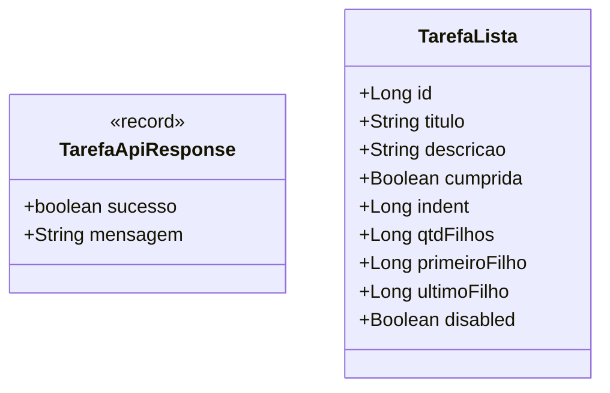

```mermaid
classDiagram
    class TarefaApiResponse {
        <<record>>
        +boolean sucesso
        +String mensagem
    }

    class TarefaLista {
        +Long id
        +String titulo
        +String descricao
        +Boolean cumprida
        +Long indent
        +Long qtdFilhos
        +Long primeiroFilho
        +Long ultimoFilho
        +Boolean disabled
    }
```
