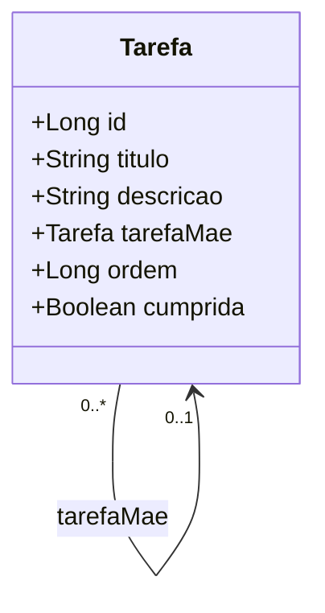

```mermaid
classDiagram
    class Tarefa {
        +Long id
        +String titulo
        +String descricao
        +Tarefa tarefaMae
        +Long ordem
        +Boolean cumprida
    }

    Tarefa "0..*" --> "0..1" Tarefa : tarefaMae
```
