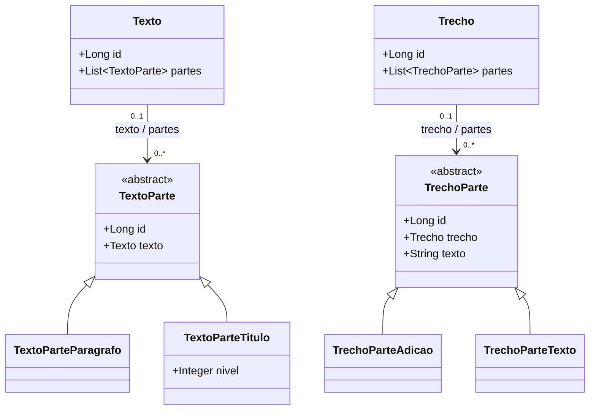

```mermaid
classDiagram
    class Texto {
        +Long id
        +List~TextoParte~ partes
    }

    class TextoParte {
        <<abstract>>
        +Long id
        +Texto texto
    }

    class TextoParteParagrafo

    class TextoParteTitulo {
        +Integer nivel
    }

    class Trecho {
        +Long id
        +List~TrechoParte~ partes
    }

    class TrechoParte {
        <<abstract>>
        +Long id
        +Trecho trecho
        +String texto
    }

    class TrechoParteAdicao
    class TrechoParteTexto

    Texto "0..1" --> "0..*" TextoParte : texto / partes
    TextoParte <|-- TextoParteParagrafo
    TextoParte <|-- TextoParteTitulo

    Trecho "0..1" --> "0..*" TrechoParte : trecho / partes
    TrechoParte <|-- TrechoParteAdicao
    TrechoParte <|-- TrechoParteTexto
```
